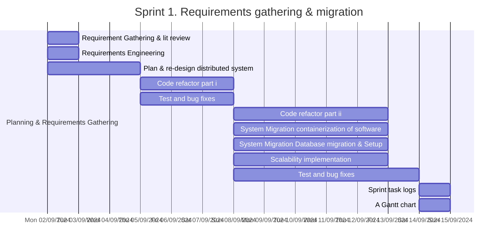
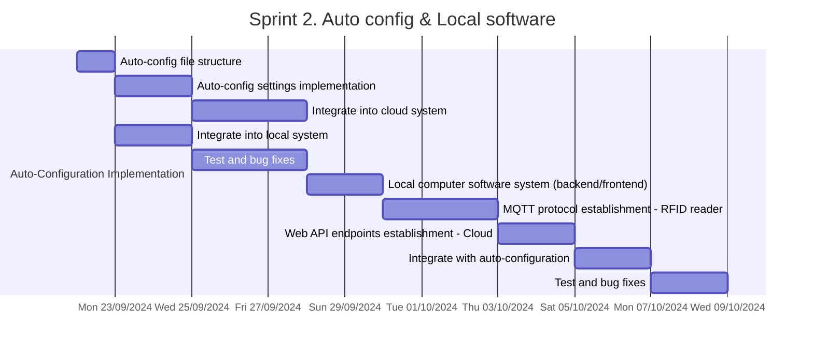
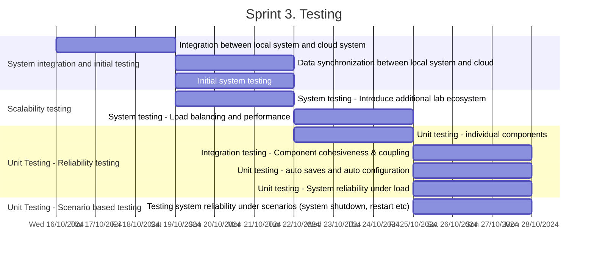
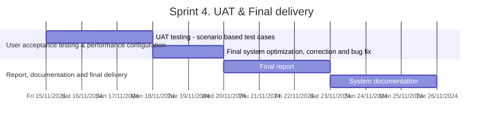

# RFID Tray Management System

## Introduction

This project is a tray management system that uses RFID technology to track the location of trays in a hospital. The system is designed to be used in a hospital setting to track the location of trays as they move through the hospital. The system consists of a set of RFID readers that are placed at various locations throughout the hospital, and a central server that collects and processes the data from the readers.

## Setup

### Hardware
1. Connect the RFID reader to the network
2. Make sure the web server on the reader is running (Turn it on in TS Service App)
3. Connect the antenna to the reader
4. Connect the camera to the network

### Web Interface

1. Install Docker
2. Install VSCode and Remote - Containers extension
3. Clone the repository
4. Open the repository in VSCode
5. Click on the green button in the bottom left corner of the window and select "Reopen in Container"
6. Run the following command to start the server:

```bash
./script.sh # sudo if necessary
```

## Usage

### First time configuration

1. Open the web interface at `http://localhost:3000`
2. Login with the default credentials
3. Go to the Config/Host IP page and set the local IP address of the reader

4. Go to the Config/Reader page and set the reader IP address and the function for each antenna port

5. Go to the Config/Power Level and overwrite the default power level if necessary


### Normal operation

#### Creating a new rack

1. Go to the Rack Management page

2. Click on the "Add Rack" button
3. Enter the rack name and the location

4. Click on the "Save" button

#### Creating a new tray

1. Go to the Tray Management/Create Tray page

2. Put the tray in front of the ReadWrite antenna that is set to "ReadWrite" function in the reader configuration
3. Click on the "Scan" button
4. Select the rack where the tray is located
5. Click on the "Create" button

#### Reading a tray

1. Go to the Tray Management/Read Tray page

2. Put the tray in front of the ReadWrite antenna that is set to "ReadWrite" function in the reader configuration
3. Click on the "Scan" button
4. The tray information will be displayed

#### Editing a tray

1. Go to the Tray Management page

2. Click the three dots button on the tray you want to edit
3. Click on the "Edit" button
4. Edit the tray information
5. Put the tray in front of the ReadWrite antenna that is set to "ReadWrite" function in the reader configuration
6. Click on the "Save" button

#### Starting and stopping inventory

1. Click the "Start Inventory" button on the navigation bar to start inventory
2. Click the "Stop Inventory" button on the navigation bar to stop inventory

# Project Gantt Chart










